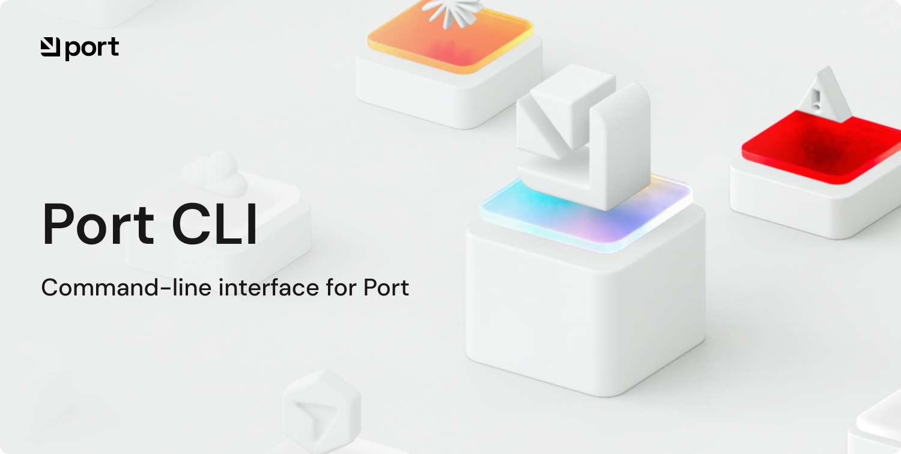

# Port CLI



<br />

A modular command-line interface for Port that enables authentication, API operations, data import/export, organization migration — using a pluggable module architecture.

## Features

- **Authenticate**: log in to multiple organizations simultaneously
- **API Operations**: Direct CRUD operations on Port resources
- **Import**: Restore data from backups
- **Export**: Backup Port data (blueprints, entities, scorecards, actions, teams, automations, pages, integrations)
- **Migrate**: Transfer data between Port organizations
- **Compare**: Diff two Port organizations and generate reports (text, JSON, HTML)
- **Clear**: Bulk-delete org resources (blueprints, entities, actions, scorecards, automations, pages)
- **Skills**: Sync AI skills from Port into your local AI coding tools (Cursor, Claude Code, Gemini CLI, OpenAI Codex, Windsurf, GitHub Copilot)

## Installation

Use `npm`:

```bash
npm install -g @port-labs/port-cli
```

<details>
<summary><strong>Quick Install Script</strong></summary>

**Linux/macOS:**

```bash
curl -fsSL https://raw.githubusercontent.com/port-labs/port-cli/main/scripts/install.sh | bash
```

This will download and install the latest release binary to `/usr/local/bin` (or `~/.local/bin` if you don't have write permissions).
</details>

<details>
<summary><strong>Binary Releases</strong></summary>
Download pre-built binaries for your platform from [GitHub Releases](https://github.com/port-labs/port-cli/releases).
</details>

<details>
<summary><strong>Docker</strong></summary>

**Build the image:**

```bash
docker build -t port-cli .
```

**Run a command:**

```bash
docker run --rm \
  -e PORT_CLIENT_ID="your-client-id" \
  -e PORT_CLIENT_SECRET="your-client-secret" \
  port-cli --help
```

**Export with output written to the host:**

```bash
docker run --rm \
  -e PORT_CLIENT_ID="your-client-id" \
  -e PORT_CLIENT_SECRET="your-client-secret" \
  -v $(pwd)/output:/data \
  port-cli export --output /data/backup.tar.gz
```

</details>

<details>
<summary><strong>Build from Source</strong></summary>

For development or if you need the latest unreleased code:

```bash
git clone https://github.com/port-labs/port-cli.git
cd port-cli
make build
./bin/port --help
```

**Note:** When building from source, use `./bin/port` instead of `port` in commands. For installed binaries, use `port` directly.

See [INSTALL.md](INSTALL.md) for detailed installation instructions.
</details>

**Verify installation:**

```bash
port --version
```

## Quick Start

### 1. Authenticate

Run `port auth login` which will open a browser for you to log into Port.
This will generate a short-lived token and allow you to perform actions on behalf of your user.

#### Use Persistent Credentials (Optional)

You can also authenticate with a client ID + secret combo.
These do not expire so they are less secure than a token.
See [Port Secrets docs](https://docs.port.io/platform-administration/secrets-management/port-secrets) for more details.

Run `port config --init` to create a configuration file at `~/.port/config.yaml`:

```yaml
default_org: production

organizations:
  production:
    client_id: your-client-id
    client_secret: your-client-secret
    api_url: https://api.getport.io/v1
```

Or use environment variables:

```bash
export PORT_CLIENT_ID="your-client-id"
export PORT_CLIENT_SECRET="your-client-secret"
export PORT_API_URL="https://api.getport.io/v1"
```

### 2. Run Commands

```bash
# Get blueprints
port api call /blueprints

# Get action runs for org
port api call /actions/runs --org my-org

# Export data
port export --output backup.tar.gz

# Import data
port import --input backup.tar.gz

# Compare organizations
port compare --source staging --target production

# Migrate between organizations
port migrate --source-org prod --target-org staging

# Clear org resources (destructive — see Clear Organization Resources below)
port clear --entities --blueprint service --force

# API operations
port api blueprints list

# Install AI skill hooks (one-time setup)
port skills init
```

**Note:** If you built from source instead of installing, use `./bin/port` instead of `port` in the commands above.

## Commands

- `port auth` - Authenticate to different organizations
- `port api` - Direct API operations (blueprints, entities)
- `port export` - Export data from Port
- `port import` - Import data to Port
- `port compare` - Compare two Port organizations
- `port migrate` - Migrate data between organizations
- `port clear` - Delete org resources in bulk (blueprints, entities, actions, etc.)
- `port skills` - Manage Port AI skill hooks and local skill sync
- `port cache` - Manage locally cached Port CLI data (e.g. `port cache clear` — local only, not org resources)
- `port config` - Manage configuration
- `port version` - Show version

## Configuration

### Configuration File

Create `~/.port/config.yaml`:

```yaml
default_org: production

organizations:
  production:
    client_id: your-client-id
    client_secret: your-client-secret
    api_url: https://api.getport.io/v1

  staging:
    client_id: staging-client-id
    client_secret: staging-client-secret
    api_url: https://api.getport.io/v1
```

### Environment Variables

```bash
PORT_CLIENT_ID          # Port API client ID
PORT_CLIENT_SECRET      # Port API client secret
PORT_API_URL            # Port API URL (optional, default https://api.getport.io/v1)
PORT_CONFIG_FILE        # Path to config file
PORT_DEFAULT_ORG        # Default organization name
PORT_DEBUG              # Enable debug mode
```

**Precedence:** CLI args > env vars > config file > defaults

The CLI also loads `~/.port/.env` (and a `.env` file in the current directory) at
startup. Existing shell environment variables are not overridden.

### Non-interactive and CI usage

For scripts, CI, and local development without a browser, use **machine
credentials** (Port application `client_id` + `client_secret`) instead of
`port auth login`. The login flow stores an OAuth token in `~/.port/creds.json`;
most commands work with either method (OAuth from `port auth login` or
`client_id` / `client_secret` from config or flags).

**Option A — environment variables** (good for CI and one-off shells):

```bash
export PORT_CLIENT_ID="your-client-id"
export PORT_CLIENT_SECRET="your-client-secret"
export PORT_API_URL="https://api.getport.io/v1"   # or http://localhost:3000/v1

port export --output backup.tar.gz
port skills list
```

**Option B — `~/.port/.env`** (persistent on your machine, same variable names):

```bash
# ~/.port/.env
PORT_CLIENT_ID=your-client-id
PORT_CLIENT_SECRET=your-client-secret
PORT_API_URL=http://localhost:3000/v1
```

**Option C — config file** (`port config --init`, then edit `~/.port/config.yaml`):

```yaml
default_org: default

organizations:
  default:
    client_id: your-client-id
    client_secret: your-client-secret
    api_url: https://api.getport.io/v1
```

**Option D — per-command flags** (highest precedence):

```bash
port api blueprints list \
  --client-id your-client-id \
  --client-secret your-client-secret \
  --api-url https://api.getport.io/v1
```

Use the **Client ID** and **Client Secret** from your Port application settings,
not the organization ID. For EU/US regions, set `api_url` to the matching Port
API base (see `port auth login --region`).

**Non-interactive command flags:** many subcommands accept flags instead of
prompts (for example `port skills init --tool Cursor --select-all-ungrouped`,
`port skills init --install-hooks` for session hooks).
Use `port --yes` / `-y` to skip confirmation prompts where supported.

See [docs/skills-setup.md](docs/skills-setup.md) for skills-specific setup and
[docs/api/CLI_API_COMMANDS.md](docs/api/CLI_API_COMMANDS.md) for global flags on
`port api` commands.

## Examples

### Automated Backups

```bash
#!/bin/bash
DATE=$(date +%Y%m%d)
./bin/port export --output "backups/port-backup-$DATE.tar.gz"

# Keep only last 30 days
find backups/ -name "port-backup-*.tar.gz" -mtime +30 -delete
```

### Compare Organizations

By default, `port compare` compares **all** resource types (blueprints, actions, scorecards, pages, integrations, teams, users). Use `--include` to narrow the comparison to specific types.

```bash
# Compare two configured organizations (all resource types)
port compare --source staging --target production

# Compare with verbose output (show identifiers)
port compare --source staging --target production --verbose

# Compare with full field-level diff
port compare --source staging --target production --full

# Compare only pages
port compare --source staging --target production --include pages

# Compare pages and blueprints together
port compare --source staging --target production --include pages,blueprints

# Compare export files
port compare --source ./staging-backup.tar.gz --target ./prod-backup.tar.gz

# Compare only pages between export files
port compare --source ./staging-backup.tar.gz --target ./prod-backup.tar.gz --include pages

# Output as JSON (for scripting)
port compare --source staging --target production --output json

# Generate interactive HTML report
port compare --source staging --target production --output html --html-file report.html

# CI/CD mode: exit code 1 if differences found
port compare --source staging --target production --fail-on-diff

# CI/CD mode scoped to pages only
port compare --source staging --target production --include pages --fail-on-diff
```

Valid `--include` values: `blueprints`, `actions`, `scorecards`, `pages`, `integrations`, `teams`, `users`.

### Clear Organization Resources

`port clear` deletes resources from a Port organization in bulk. It complements upsert-only `import` and `migrate` — use it when you need to remove drift or rebuild a sandbox to a known state.

**Do not confuse with other "clear" commands:**

| Command             | Scope                               |
| ------------------- | ----------------------------------- |
| `port clear`        | Port org resources (API deletes)    |
| `port cache clear`  | Local CLI hooks, skills, and config |
| `port skills clear` | Local synced skill files only       |

At least one resource-type flag is required: `--entities`, `--actions`, `--scorecards`, `--automations`, `--pages`, or `--blueprints`. When multiple types are selected, dependents are deleted before parents: entities → actions → scorecards → automations → pages → blueprints.

Use `--blueprint` (repeatable) to scope `--entities`, `--actions`, `--scorecards`, and `--blueprints` to specific blueprints. Use `--jq` to filter which entities are deleted (e.g. `--jq '.properties.state == "archived"'`).

System blueprints (identifiers starting with `_`, such as `_user` and `_team`) are always skipped for `--blueprints`. Their entities, actions, and scorecards are also skipped unless you pass `--include-system-blueprints`. Root pages and folders whose identifiers start with `_` are skipped unless you pass `--delete-protected-pages`.

By default, `port clear` prompts for confirmation. Pass `--force` to skip the prompt (recommended in scripts). Use `--org` to target a specific organization.

**Limitations:**

- Does not delete teams, users, integrations, or permissions
- `--pages` deletes root sidebar pages and folders only (not nested children)
- Not a full idempotent apply on its own — pair with `import` or `compare`

```bash
# Delete all entities for a specific blueprint
port clear --entities --blueprint service --force

# JQ-filtered entity delete
port clear --entities --blueprint aiSpec --jq '.properties.organization == "example-org"' --force

# Full sandbox reset (supported config types), then re-import
port clear --entities --actions --scorecards --automations --pages --blueprints --force --org sandbox
port import --input ./config.tar.gz --org sandbox

# Verify convergence
port compare --source ./config.tar.gz --target sandbox --fail-on-diff
```

**Common workflows:**

- **Sandbox rebuild:** `clear` (supported types) → `import` → `compare --fail-on-diff`
- **Drift remediation:** `compare --output json` to find extras, delete via scoped `clear` or `port api`, then `import`
- **Stage/prod:** prefer `import`/`migrate` + `compare` for gating; avoid blanket `clear`

### User Import

Users are imported as `STAGED` (pending activation) rather than being sent an invitation email. Existing users are updated with source data as-is.

Use `--users-as-disabled` to set non-admin new users to `DISABLED` instead (admin users are always staged):

```bash
# Import users as disabled (non-admins only)
port import --input backup.tar.gz --users-as-disabled

# Migrate users as disabled
port migrate --source-org prod --target-org staging --users-as-disabled
```

### Pre-Production Testing

```bash
# Export from production
./bin/port export --output prod.tar.gz --org production

# Import to staging
./bin/port import --input prod.tar.gz --org staging

# Compare to verify changes
./bin/port compare --source prod.tar.gz --target staging --verbose

# Test changes in staging...

# When ready, migrate back
./bin/port migrate --source-org staging --target-org production
```

To rebuild a sandbox org to match a known config (when `import` alone cannot remove extra resources), clear supported types first, then import and verify:

```bash
./bin/port clear --entities --actions --scorecards --automations --pages --blueprints --force --org sandbox
./bin/port import --input ./config.tar.gz --org sandbox
./bin/port compare --source ./config.tar.gz --target sandbox --fail-on-diff
```

### Docker

```bash
# Export to a local directory
docker run --rm \
  -e PORT_CLIENT_ID="your-client-id" \
  -e PORT_CLIENT_SECRET="your-client-secret" \
  -v $(pwd)/output:/data \
  port-cli export --output /data/backup.tar.gz

# Import from a local file
docker run --rm \
  -e PORT_CLIENT_ID="your-client-id" \
  -e PORT_CLIENT_SECRET="your-client-secret" \
  -v $(pwd)/output:/data \
  port-cli import --input /data/backup.tar.gz

# Compare two organizations
docker run --rm \
  -e PORT_CLIENT_ID="source-client-id" \
  -e PORT_CLIENT_SECRET="source-client-secret" \
  -e PORT_TARGET_CLIENT_ID="target-client-id" \
  -e PORT_TARGET_CLIENT_SECRET="target-client-secret" \
  port-cli compare --fail-on-diff
```

### AI Skill Hooks

> [!WARNING]  
> This functionality is planned to be deprecated in the future. If you're using
> it, you can keep doing so, but note that we will introduce a new way of working with skills.

Automatically sync skills from your Port organization into local AI coding tools (Cursor, Claude Code, Gemini CLI, OpenAI Codex, Windsurf, GitHub Copilot).
Synced and uploaded skills follow the [Agent Skills specification](https://agentskills.io/specification): a skill directory with `SKILL.md` at the root, plus optional `scripts/`, `references/`, and `assets/`.
The default skills model supports sync/list/search. Upload and publish commands require the labs versioned skills data model; contact Port to enable it.

```bash
# One-time setup: choose tools and skill selection (saved to ~/.port/config.yaml)
port skills init

# Download skills to disk (after init, or pass --tool for a one-off sync)
port skills sync
port skills sync --tool Cursor --group operations
port skills sync --tool Cursor --tool "Claude Code" --tool Windsurf

# Scripts/CI: explicit flags or -y to select every option without prompts
port skills init -y
port skills init --tool Cursor --select-all-groups --select-all-ungrouped
port skills add --group my-group --skill my-skill --tool Cursor
port skills add integrations-overview
port skills add -y
port skills remove integrations-overview
port skills remove --tool Windsurf

# Check what's configured
port skills status

# Delete locally synced skill files only (hooks remain; skills re-sync on next session)
port skills clear

# Full cleanup: remove hooks, skill files, and config — everything Port CLI installed
port cache clear
```

See [docs/skills-setup.md](docs/skills-setup.md) for full setup instructions, including the [main skills data model](docs/skills-main-data-model.md) and [labs versioned skills data model](docs/skills-versioned-data-model.md).

## Contributing

See [CONTRIBUTING.md](CONTRIBUTING.md) for development guidelines.

## Release Process

See [RELEASE.md](RELEASE.md) for release procedures.

## License

MIT License - see [LICENSE](LICENSE)

## References

- [Port Documentation](https://docs.getport.io)
- [Port API Reference](https://docs.getport.io/api-reference/port-api)

---

<picture>
  <source media="(prefers-color-scheme: dark)"
  srcset="./docs/port_logo_black.svg">
  
</picture>
